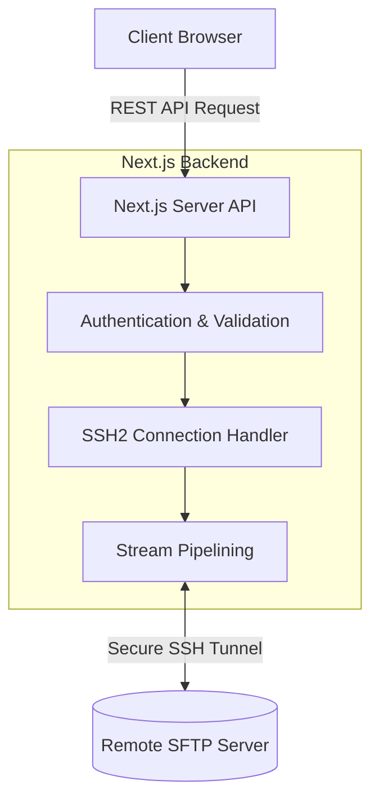
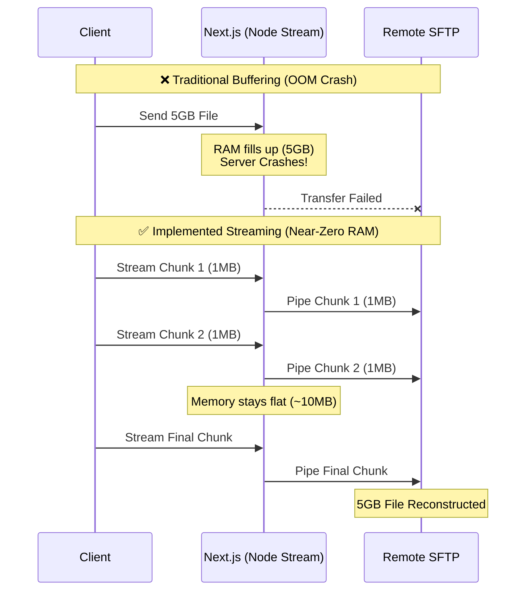
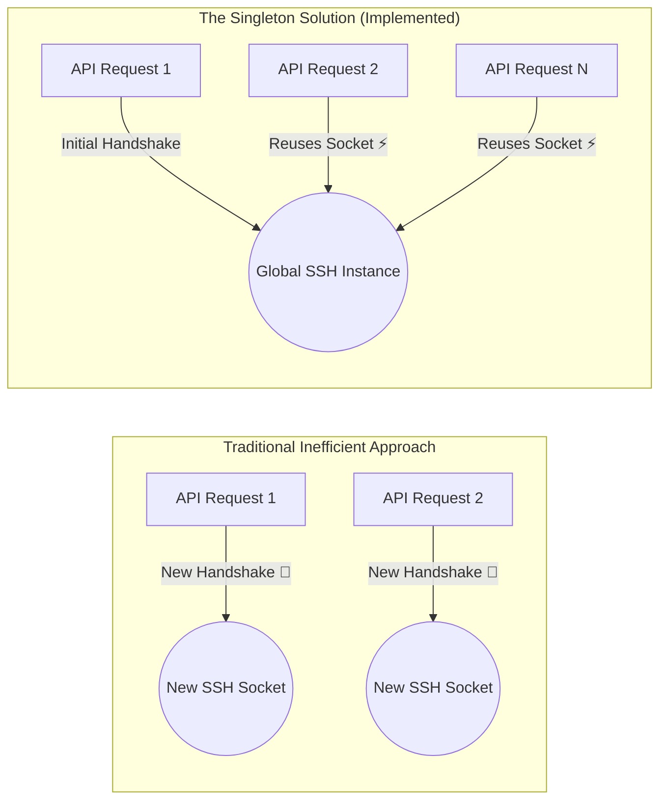

# Next.js SFTP File Manager

A robust, stateless web-based file manager built with Next.js 14 and React that securely bridges client browsers to any remote server via SFTP. 

## 🌍 Real-World Use Cases
While standard desktop clients (like FileZilla) exist, this architecture solves several enterprise-level problems:
1. **Secure Client Portals**: Allows non-technical clients to securely upload/download documents without needing SSH keys or terminal knowledge.
2. **Stateless Gateway**: Acts as a proxy, meaning credentials and network details of the actual storage servers are completely hidden from the end-user.
3. **Cross-Platform Accessibility**: Provides instant file management access from any device with a web browser, requiring zero local installation.

## 🏗️ High-Level Architecture & Flow



### Core Design Principles
- **Stateless Proxying**: The Next.js backend holds no state or local files. It purely authenticates and tunnels operations.
- **Direct Streaming**: All file transfers bypass disk and memory buffering, ensuring the server doesn't crash on massive files.


---

## 🛠️ Tech Stack
- **Framework:** Next.js 14 (App Router)
- **Frontend:** React 18, Tailwind CSS, Lucide React
- **Backend Infrastructure:** Node.js Streams, `busboy` (Multipart parsing), `ssh2` (SFTP Client)
- **Environment:** Docker & Docker Compose

---

## 🚀 How to Run

### Prerequisites
- Docker and Docker Compose installed.

### 1. Configure Environment
Create a `.env` file from the example:
```bash
cp .env.example .env
```

### 2. Start the System (Docker Full Stack)
The repository includes a mock SFTP server (`atmoz/sftp`) via Docker Compose for instant local testing without needing an external server.
```bash
docker-compose up --build
```
- **Next.js App:** `http://localhost:3000`
- **Mock SFTP Server:** `localhost:2222` (Mapped to internal Docker port 22)

### Local Development (Node.js)
If you prefer running the Next.js app locally against the Dockerized SFTP server:
1. Run `docker-compose up sftp -d`
2. Run `npm install`
3. Run `npm run dev`

---

## 🧩 Key Engineering Challenges & Solutions

Building this proxy layer introduced significant data-handling challenges:

*   **⚡ Challenge 1: Handling Large File Uploads (OOM Errors)**
    *   *Solution:* Implemented a strict Stream-to-Stream pipeline. By converting the Next.js web stream into a Node `Readable` stream, the payload bypasses RAM and is fed directly to the SFTP target, allowing infinitely large file uploads with a constant memory footprint of just a few megabytes.



*   **⏱️ Challenge 2: Overcoming SSH Handshake Latency in Serverless**
    *   *Solution:* Creating a new SSH connection on every single API request introduces massive TCP handshake overhead and massive latency. To solve this, `src/lib/sftp.ts` implements a persistent singleton connection. The Next.js server maintains a single active socket and pools requests through it, drastically reducing latency for all subsequent file operations.



---

## 🔮 Future Scope & Improvements
While fully functional, the system could be extended for enterprise scale:
1. **Multi-Server Management**: Extending the current connection logic to support dynamic connections to multiple distinct SFTP servers simultaneously, rather than a single environment-bound host.
2. **Chunked & Resumable Uploads**: Transitioning from a single continuous stream to a chunked upload architecture, allowing users to pause/resume uploads and making the system highly resilient to network drops.
3. **Caching Layer**: Integrating Redis to cache directory listings (`/api/sftp/list`), dramatically speeding up folder navigation for frequently accessed directories.
